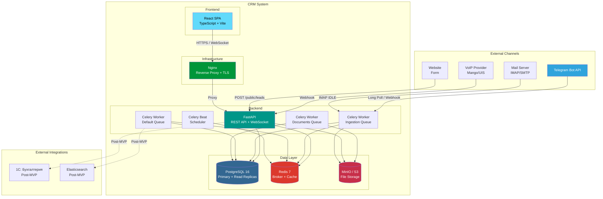
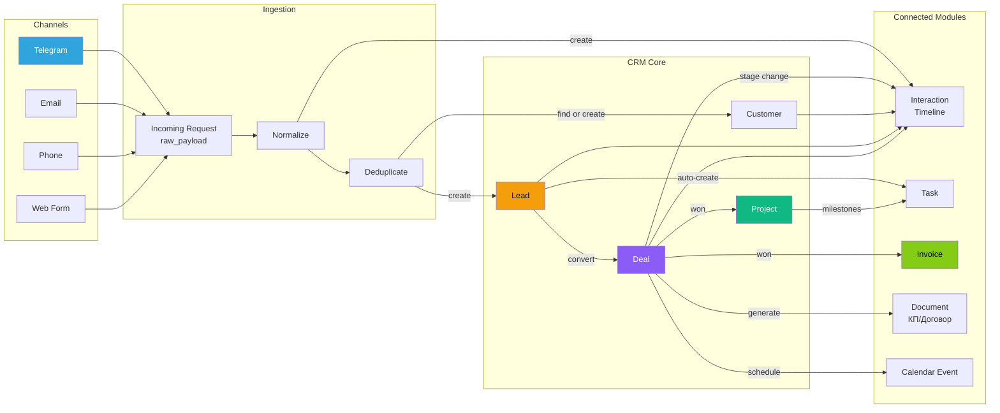
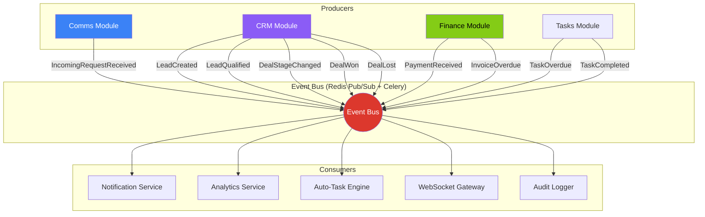
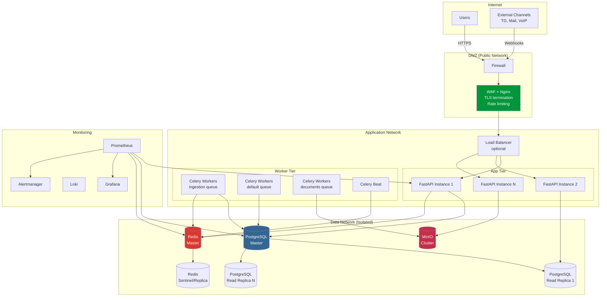
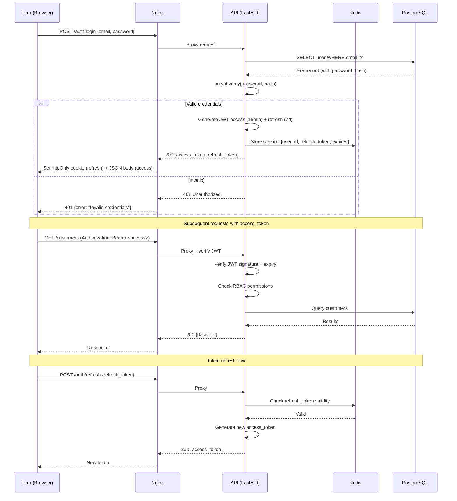
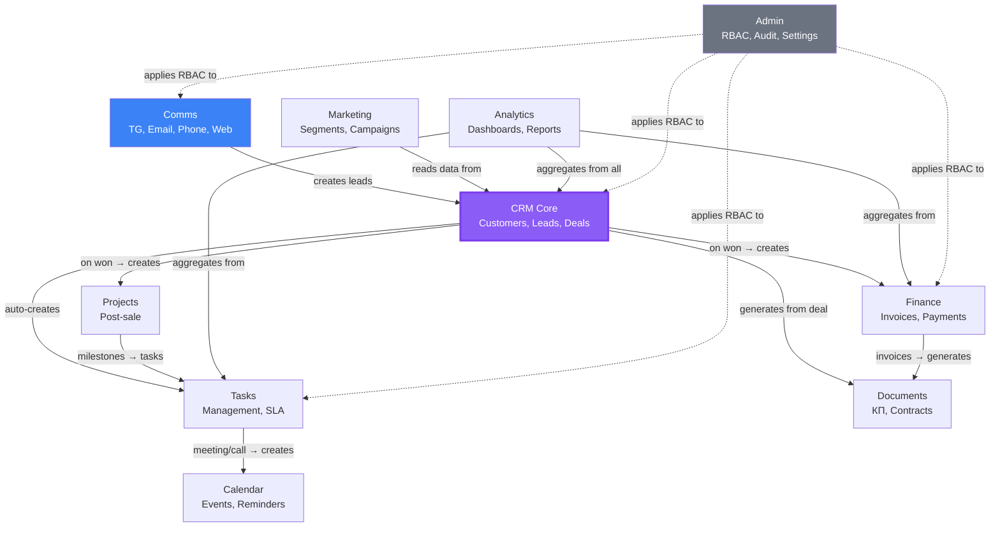
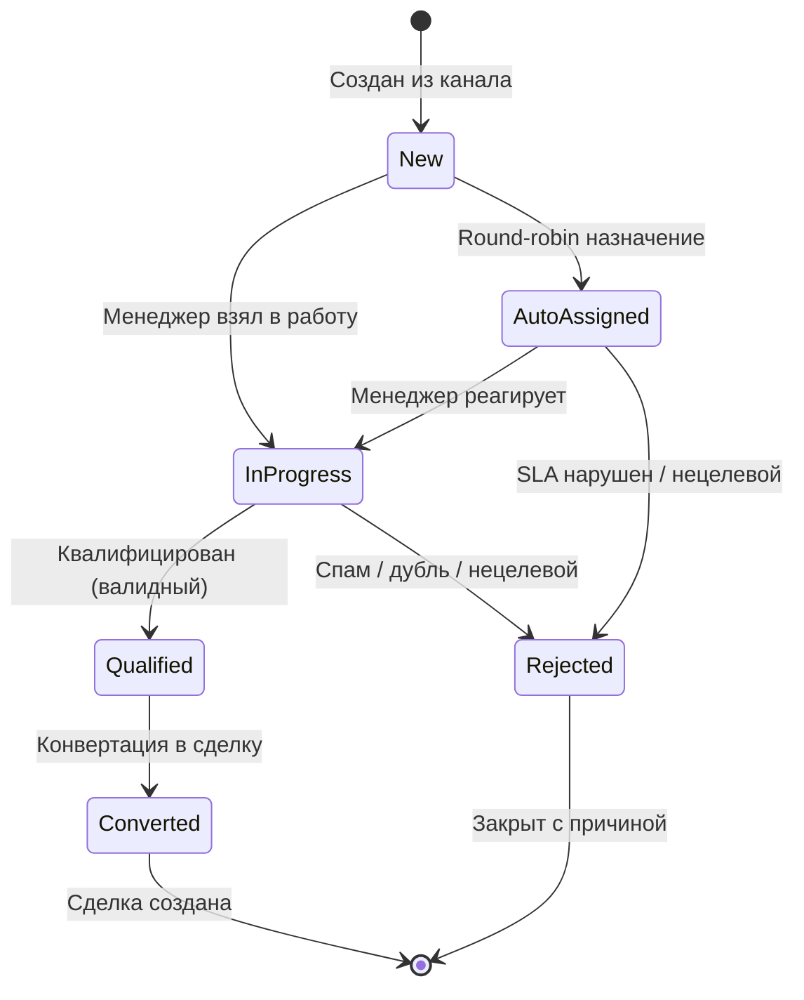
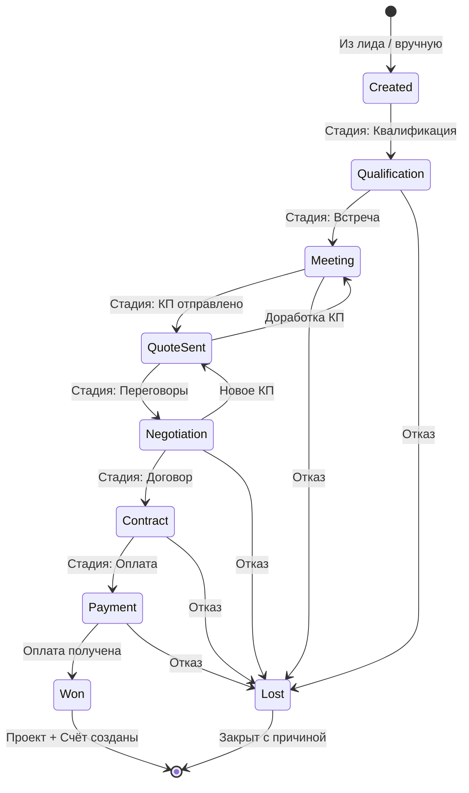

# Архитектурные диаграммы (Mermaid)

> Все диаграммы в формате Mermaid для рендеринга в GitHub/GitLab или любом Markdown-просмотрщике с поддержкой Mermaid.

---

## 1. System Architecture (C4 — Container Level)

---

## 2. Data Flow: Incoming Request → Lead → Deal → Project

---

## 3. Domain Events Flow

---

## 4. Deployment Architecture

---

## 5. Authentication Flow

---

## 6. Module Dependencies

---

## 7. Lead Lifecycle State Machine

---

## 8. Deal Lifecycle State Machine

