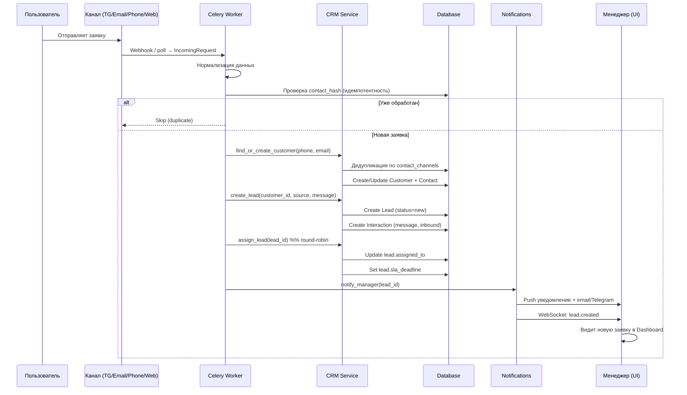
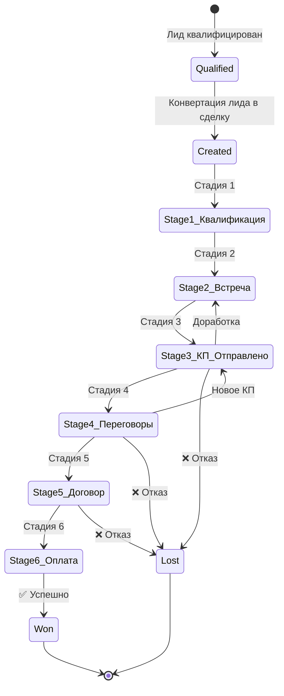
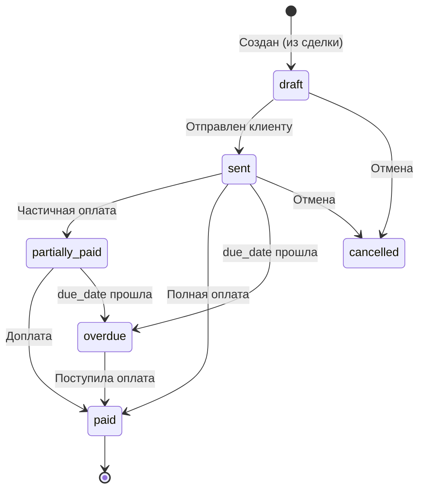
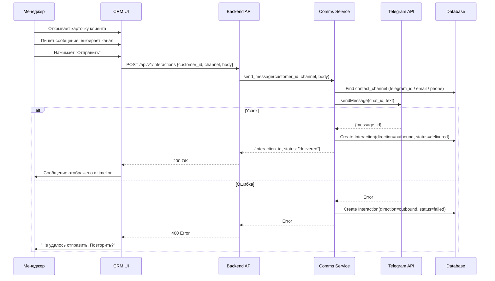
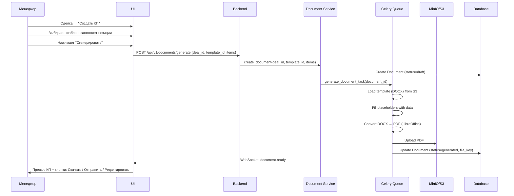

# 06. Бизнес-процессы

> Пошаговое описание ключевых бизнес-процессов системы.

---

## BP-1. Поступление и обработка входящей заявки

### Sequence Diagram



### Пошаговое описание

| Шаг | Действие | Система | Авто/Вручную |
|-----|----------|---------|:------------:|
| 1 | Заявка поступает из канала | Ingestion Worker | Авто |
| 2 | Сырые данные сохраняются в `incoming_requests` | Worker | Авто |
| 3 | Нормализация: извлечение phone, email, name, message | Worker | Авто |
| 4 | Проверка идемпотентности по `contact_hash` | Worker | Авто |
| 5 | Дедупликация клиента по `contact_channels` | CRM Service | Авто |
| 6 | Создание/обновление Customer + Contact | CRM Service | Авто |
| 7 | Проверка: есть ли открытый лид у этого клиента? | CRM Service | Авто |
| 8 | Если нет открытого лида → создание Lead(status=new) | CRM Service | Авто |
| 9 | Если есть → привязка interaction к существующему лиду | CRM Service | Авто |
| 10 | Авто-распределение (round-robin/rules) | CRM Service | Авто |
| 11 | Установка SLA-дедлайна (реакция в течение 30 мин) | CRM Service | Авто |
| 12 | Уведомление менеджера | Notifications | Авто |
| 13 | Real-time обновление UI (WebSocket) | WebSocket | Авто |
| 14 | Автоответ клиенту (по каналу) | Comms | Авто |
| 15 | Менеджер открывает карточку лида | UI | Вручную |
| 15 | Менеджер реагирует (звонок/письмо/сообщение) | UI | Вручную |
| 16 | `lead.responded_at = now()` → SLA выполнен | CRM Service | Авто |

### SLA правила

| Приоритет лида | Время реакции |
|----------------|---------------|
| `urgent` | 15 минут |
| `high` | 30 минут |
| `medium` | 2 часа |
| `low` | 4 часа |

> При нарушении SLA: эскалация руководителю отдела.

---

## BP-2. Квалификация лида

### Flow

```
Лид (status=in_progress)
    │
    ├─ Менеджер квалифицирует лид
    │   │
    │   ├─ ВАЛИДНЫЙ → status=qualified → Конвертация в сделку
    │   │
    │   └─ НЕВАЛИДНЫЙ → status=rejected
    │       ├─ spam (спам)
    │       ├─ invalid (невалидные данные)
    │       ├─ duplicate (дубль)
    │       ├─ not_target (нецелевой клиент)
    │       └─ other (другое)
    │
    └─ При квалификации заполняется:
        ├─ Категория клиента (new/returning/vip)
        ├─ Потребность (описание)
        ├─ Бюджет (диапазон)
        ├─ Срочность
        └─ Лид-скоринг (пересчёт)
```

### Критерии квалификации

| Критерий | Валидный | Невалидный |
|----------|----------|------------|
| Контактные данные | Полные (phone + email) | Неполные / фейковые |
| Потребность сформулирована | Да, конкретно | Нет / размыто |
| Бюджет соответствует | Да | Нет / не озвучен и нет интереса |
| Полномочия | Лицо принимающее решение | Нет полномочий |
| Срочность | Есть потребность | «Просто узнаю» |

---

## BP-3. Назначение менеджера и распределение

### Стратегии распределения

#### Round-Robin (по умолчанию)

```
Активные менеджеры отдела "Продажи":
  [М1, М2, М3, М4]

Новый лид → М1
Новый лид → М2
Новый лид → М3
Новый лид → М4
Новый лид → М1 (снова)
...
```

#### Load-Balanced

```
Текущая загрузка:
  М1: 12 открытых лидов
  М2: 8 открытых лидов  ← наименее загружен
  М3: 15 открытых лидов

Новый лид → М2
```

#### Rule-Based (по правилам)

| Условие | Назначить |
|---------|-----------|
| `industry == "IT"` | Отдел IT-продаж |
| `region == "СПб"` | Менеджер СПб |
| `amount > 1M ₽` | Senior менеджер |
| `source == "referral"` | Менеджер, привёдший реферала |

### Ручное переназначение

Менеджер может:
1. Принять лид в работу (self-assign)
2. Передать другому менеджеру (с причиной)
3. Вернуть в нераспределённый пул

---

## BP-4. Ведение сделки

### Жизненный цикл сделки



### Действия на каждой стадии

| Стадия | Действия менеджера | Автоматика |
|--------|-------------------|------------|
| **Квалификация** | Анализ потребности, бюджет | Создание задач follow-up |
| **Встреча/Презентация** | Назначение встречи, проведение | Calendar event, напоминание |
| **КП отправлено** | Подготовка КП из шаблона, отправка | Отслеживание открытия КП |
| **Переговоры** | Согласование условий | Задача «Перезвонить через 2 дня» |
| **Договор** | Подготовка договора, согласование | — |
| **Оплата** | Контроль поступления оплаты | Авто-напоминание об оплате |

### Перемещение по воронке

```python
# Перемещение сделки на следующую стадию
async def move_deal_stage(deal_id: UUID, new_stage_id: UUID, user_id: UUID):
    deal = await deal_repo.get(deal_id)

    # 1. Валидация: стадия существует в воронке
    new_stage = await stage_repo.get(new_stage_id)
    if new_stage.pipeline_id != deal.pipeline_id:
        raise InvalidStageError("Stage not in deal's pipeline")

    # 2. Сохранение старой стадии
    old_stage_id = deal.stage_id
    old_probability = deal.probability

    # 3. Обновление
    deal.stage_id = new_stage_id
    deal.probability = new_stage.probability
    await deal_repo.save(deal)

    # 4. Создание interaction (status_change)
    await interaction_service.create_status_change(
        deal_id=deal_id,
        old_value=old_stage.name,
        new_value=new_stage.name,
        user_id=user_id,
    )

    # 5. Публикация события
    await event_bus.publish(DealStageChanged(
        deal_id=deal_id,
        old_stage_id=old_stage_id,
        new_stage_id=new_stage_id,
    ))

    # 6. Триггеры автозадач
    await auto_task_engine.trigger_for_stage(new_stage_id, deal_id)
```

---

## BP-5. Закрытие сделки

### Вариант A: Выиграна (Won)

```
Deal.status = 'won'
    │
    ├─ 1. Установка статуса + actual_close_date
    │
    ├─ 2. Создание Project (из шаблона по типу сделки)
    │   ├─ name = deal.title
    │   ├─ customer_id, deal_id
    │   ├─ manager_id = deal.assigned_to
    │   ├─ budget_planned = deal.amount
    │   └─ milestones из шаблона
    │
    ├─ 3. Создание Invoice (draft)
    │   ├─ customer_id, deal_id
    │   ├─ total = deal.amount
    │   └─ items из сделки
    │
    ├─ 4. Создание задач
    │   ├─ «Подготовить договор» (due +1 день)
    │   ├─ «Создать проект» (due +2 дня)
    │   └─ «Отправить акт» (после оплаты)
    │
    ├─ 5. Обновление customer-агрегатов
    │   ├─ total_revenue += deal.amount
    │   └─ deals_count += 1
    │
    ├─ 6. Уведомления
    │   ├─ Менеджеру: "Сделка выиграна! Создан проект #X"
    │   ├─ Финансовому отделу: "Новый счёт для выставления"
    │   └─ Руководителю: "Сделка закрыта успешно"
    │
    └─ 7. Обновление аналитики
        └─ Метрики: revenue, win_rate, avg_deal_size
```

### Вариант B: Проиграна (Lost)

```
Deal.status = 'lost'
    │
    ├─ 1. Установка статуса + lost_reason + lost_reason_note
    │
    ├─ 2. Отмена связанных открытых задач
    │
    ├─ 3. Уведомления
    │   └─ Руководителю: "Сделка проиграна. Причина: X"
    │
    └─ 4. Обновление аналитики
        └─ Метрики: lost_rate, lost by reason
```

### Обязательные поля при закрытии

| Статус | Обязательные поля |
|--------|-------------------|
| `won` | `actual_close_date` |
| `lost` | `lost_reason` (enum), `lost_reason_note` (опц.) |

---

## BP-6. Переход в проект и контроль исполнения

### Создание проекта из сделки

```python
async def create_project_from_deal(deal_id: UUID) -> Project:
    deal = await deal_repo.get(deal_id)

    # 1. Создание проекта
    project = Project(
        name=f"Проект: {deal.title}",
        description=deal.description,
        deal_id=deal.id,
        customer_id=deal.customer_id,
        manager_id=deal.assigned_to,
        status="planning",
        start_date=date.today(),
        budget_planned=deal.amount,
    )
    await project_repo.save(project)

    # 2. Добавление участников
    await project_repo.add_member(project.id, deal.assigned_to, role="manager")

    # 3. Создание этапов из шаблона
    template = await get_project_template(deal.metadata.get("service_type"))
    for ms_data in template["milestones"]:
        milestone = ProjectMilestone(
            project_id=project.id,
            name=ms_data["name"],
            order=ms_data["order"],
            due_date=date.today() + timedelta(days=ms_data["duration_days"]),
        )
        await milestone_repo.save(milestone)

    # 4. Обновление сделки
    deal.project_id = project.id
    await deal_repo.save(deal)

    # 5. Уведомления
    await notify_project_created(project)

    return project
```

### Контроль исполнения

| Контроль | Частота | Действие при нарушении |
|---------|---------|------------------------|
| Дедлайн этапа | Ежедневно | Уведомление менеджеру + руководителю |
| Прогресс этапа | При обновлении | Пересчёт `project.progress` |
| Бюджет проекта | При затратах | Уведомление при `budget_actual > budget_planned * 0.9` |
| Задачи проекта | Ежедневно | Просроченные → эскалация |

---

## BP-7. Финансовое закрытие

### Flow

```
Deal Won
    │
    ├─ Invoice (draft) создан
    │
    ▼
Инвойс отправлен (status=sent)
    │
    ├─ Ожидание оплаты (due_date)
    │
    ├─ Частичная оплата (status=partially_paid)
    │   └─ paid_amount < total
    │
    ├─ Полная оплата (status=paid)
    │   └─ paid_amount >= total
    │
    ├─ Просрочка (status=overdue)
    │   └─ due_date < today AND paid_amount < total
    │       └─ Уведомление менеджеру + finance
    │
    ▼
После полной оплаты:
    │
    ├─ Генерация акта выполненных работ
    ├─ Отправка акта клиенту (email/Telegram)
    │
    ├─ Экспорт в 1С (post-MVP)
    │   ├─ Контрагент
    │   ├─ Счёт
    │   └─ Акт
    │
    ├─ Обновление customer.total_revenue
    │
    └─ Проект → status=completed (если все этапы done)
```

### Жизненный цикл счёта



---

## BP-8. Коммуникация с клиентом

### Отправка сообщения из CRM



---

## BP-9. Управление задачами и контроль сотрудников

### Постановка задачи

| Поле | Обязательно | Описание |
|------|:-----------:|----------|
| title | ✅ | Заголовок |
| assignee_id | ✅ | Исполнитель |
| due_date | ✅ | Дедлайн |
| priority | ✅ | Приоритет |
| type | ✅ | Тип (call/email/meeting/document) |
| description | ❌ | Подробное описание |
| parent_task_id | ❌ | Родительская задача |
| customer/deal/lead/project_id | ❌ | Привязка к сущности |
| checklist | ❌ | Чек-лист подзадач |

### Контроль исполнения

```
Ежедневный контроль (Celery Beat):
    │
    ├─ Задачи с due_date = today → напоминание исполнителю
    │
    ├─ Задачи с due_date < today AND status != done
    │   └─ Просрочены → уведомление исполнителю + руководителю
    │
    ├─ Задачи со status = review
    │   └─ Напоминание контролёру (reviewer)
    │
    └─ Ежедневный отчёт руководителю:
        ├─ Просроченные задачи отдела
        ├─ Задачи на сегодня/завтра
        └─ Процент выполнения за неделю
```

---

## BP-10. Генерация КП и работа с документами

### Генерация КП



### Шаблоны по умолчанию

| Шаблон | Тип | Переменные |
|--------|-----|------------|
| Коммерческое предложение | `quote` | customer, deal, items[], date, validity |
| Договор оказания услуг | `contract` | customer, deal, items, payment_terms, date |
| Счёт на оплату | `invoice_doc` | customer, invoice, items, total |
| Акт выполненных работ | `act` | customer, project, milestones, total |

---

## BP-11. Напоминания и уведомления

### Каналы уведомлений

| Канал | Назначение | Настройка |
|-------|-----------|-----------|
| In-app (WebSocket) | Real-time badge + toast | Всегда включено |
| Email | Для важных событий | Включается пользователем |
| Telegram | Для срочных событий | Включается пользователем |
| Push (PWA) | Mobile-уведомления | Включается пользователем |

### Типы уведомлений

| Событие | Кому | Канал | Приоритет |
|---------|------|-------|-----------|
| Новый лид | Ответственному менеджеру | In-app + TG | High |
| Просрочен SLA | Менеджеру + руководителю | In-app + Email | Urgent |
| Новое сообщение по лиду | Менеджеру | In-app | Medium |
| Задача просрочена | Исполнителю + руководителю | In-app + Email | High |
| Сделка выиграна | Менеджеру + руководству | In-app + Email | Medium |
| Оплата получена | Финансовому отделу | In-app | Medium |
| Напоминание о встрече | Участникам | In-app + TG | High |

---

## BP-12. Ежедневные и периодические процессы

| Процесс | Расписание | Описание |
|---------|-----------|----------|
| IMAP poll | Каждые 30 сек | Проверка новых писем |
| Telegram poll | Каждые 2 сек | Long polling обновлений бота |
| SLA check | Каждые 5 мин | Проверка дедлайнов реакции |
| Task reminder | Ежечасно | Напоминания о задачах на сегодня |
| Overdue tasks check | Ежечасно | Проверка просроченных задач |
| Morning digest | 09:00 ежедневно | Отчёт для каждого менеджера |
| Daily summary | 18:00 ежедневно | Сводка для руководителя |
| Weekly report | Пн 09:00 | Недельная аналитика |
| Invoice overdue check | Ежедневно 10:00 | Проверка просроченных счетов |
| Auto-archive | Ежедневно 02:00 | Архивация закрытых лидов (>90 дней) |
| DB backup (full) | Ежедневно 03:00 | Полный бэкап PostgreSQL |
| DB backup (WAL) | Непрерывно | Point-in-time recovery |
