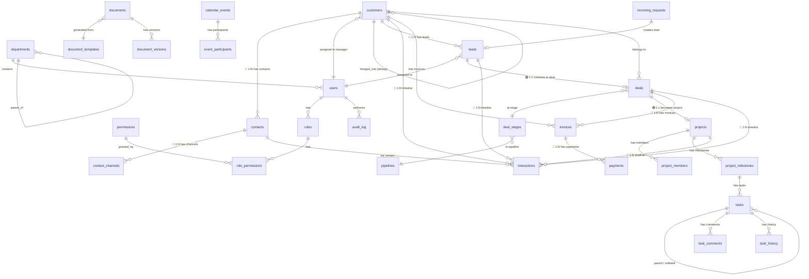
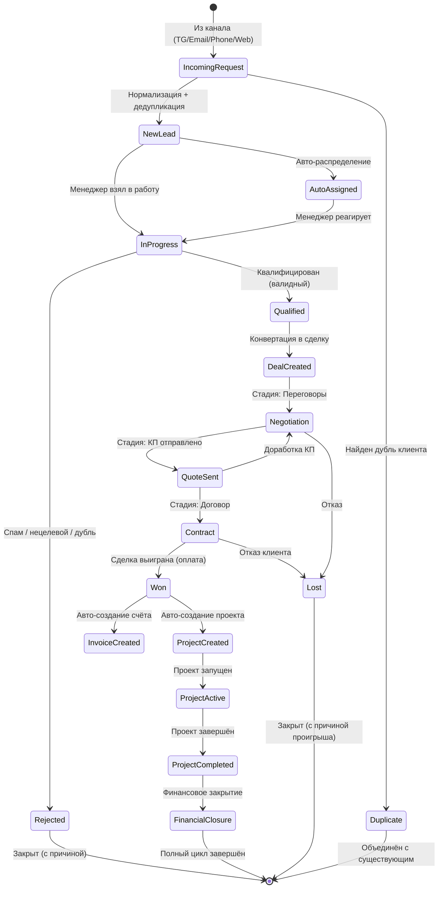

# 04. Модель данных (логическая)

---

## 1. Обзор модели данных

Модель данных построена по принципу **Single Source of Truth**. Все сущности связаны через ядро CRM (customers → leads → deals → projects) с единой системой взаимодействий (interactions) и гибкими связями.

### Цветовая легенда связей
- **🟢 1:1** — один к одному
- **🔵 1:N** — один ко многим
- **🟠 N:N** — многие ко многим

---

## 2. ER-диаграмма (Mermaid)



---

## 3. Полный список сущностей

### 3.1. Системные сущности (Admin)

| # | Сущность | Таблица | Записей (оценка) | Описание |
|---|----------|---------|------------------|----------|
| 1 | Пользователи | `users` | 10–500 | Сотрудники компании |
| 2 | Роли | `roles` | 5–10 | Группы прав |
| 3 | Разрешения | `permissions` | ~60 | Гранулярные права |
| 4 | Связь ролей и прав | `role_permissions` | — | N:N |
| 5 | Отделы | `departments` | 3–10 | Иерархия подразделений |
| 6 | Журнал аудита | `audit_log` | 10K+/мес | Лог действий (партицированный) |

### 3.2. CRM (Клиенты, Лиды, Сделки)

| # | Сущность | Таблица | Записей (оценка) | Описание |
|---|----------|---------|------------------|----------|
| 7 | Клиенты | `customers` | до 100K | Физлица и юрлица |
| 8 | Контакты | `contacts` | 1–5 на клиента | Контактные лица |
| 9 | Каналы связи | `contact_channels` | 1–3 на контакт | Phone/email/tg |
| 10 | Лиды | `leads` | 5K+/мес | Входящие заявки |
| 11 | Сделки | `deals` | 1K+/мес | В работе |
| 12 | Воронки | `pipelines` | 2–5 | Настраиваемые |
| 13 | Стадии воронки | `deal_stages` | 5–10 на воронку | Этапы |

### 3.3. Коммуникации

| # | Сущность | Таблица | Записей (оценка) | Описание |
|---|----------|---------|------------------|----------|
| 14 | Взаимодействия | `interactions` | 50K+/мес | Единый timeline (партиц.) |
| 15 | Входящие заявки | `incoming_requests` | 5K+/мес | Raw payloads до нормализации |

### 3.4. Задачи и Проекты

| # | Сущность | Таблица | Записей (оценка) | Описание |
|---|----------|---------|------------------|----------|
| 16 | Задачи | `tasks` | 10K+/мес | С подзадачами и историей |
| 17 | Комментарии задач | `task_comments` | — | Обсуждения |
| 18 | История задач | `task_history` | — | Аудит изменений |
| 19 | Проекты | `projects` | 200+/год | Post-sale |
| 20 | Участники проектов | `project_members` | — | N:N |
| 21 | Этапы проектов | `project_milestones` | 3–10 на проект | Milestones |

### 3.5. Финансы

| # | Сущность | Таблица | Записей (оценка) | Описание |
|---|----------|---------|------------------|----------|
| 22 | Счета | `invoices` | 1K+/мес | Выставленные |
| 23 | Оплаты | `payments` | — | Поступившие |

### 3.6. Документы

| # | Сущность | Таблица | Записей (оценка) | Описание |
|---|----------|---------|------------------|----------|
| 24 | Документы | `documents` | 5K+/год | КП, договоры, счета, акты |
| 25 | Шаблоны документов | `document_templates` | 10–30 | DOCX/PDF |
| 26 | Версии документов | `document_versions` | — | История |

### 3.7. Календарь

| # | Сущность | Таблица | Записей (оценка) | Описание |
|---|----------|---------|------------------|----------|
| 27 | События | `calendar_events` | 1K+/мес | Встречи, звонки, напоминания |
| 28 | Участники событий | `event_participants` | — | N:N |

### 3.8. Маркетинг (Post-MVP)

| # | Сущность | Таблица | Записей (оценка) | Описание |
|---|----------|---------|------------------|----------|
| 29 | Кампании | `marketing_campaigns` | 10–50 | Реклама |
| 30 | Сегменты | `customer_segments` | 10–30 | Динамические |

---

## 4. Жизненный цикл: Заявка → Сделка → Проект

### 4.1. Диаграмма состояний (State Machine)



### 4.2. Подробное описание переходов

| Переход | Триггер | Поля обновляются | Создаются |
|---------|---------|------------------|-----------|
| → NewLead | `IncomingRequest.processed` | `lead.status=new`, `lead.source` | `customer`, `contact`, `interaction` |
| → InProgress | Manager action | `lead.status=in_progress`, `responded_at` | `task` (follow-up) |
| → Qualified | Manager action | `lead.status=qualified` | — |
| → Rejected | Manager action | `lead.status=rejected`, `rejection_reason` | — |
| → DealCreated | `Lead.convert()` | `lead.status=converted`, `lead.deal_id` | `deal`, `tasks[]` |
| Stage → Next | Drag-and-drop / API | `deal.stage_id`, `deal.probability` | `interaction` (status_change) |
| → Won | `deal.close(won)` | `deal.status=won`, `actual_close_date` | `project`, `invoice(draft)`, `task(prepare_contract)` |
| → Lost | `deal.close(lost)` | `deal.status=lost`, `lost_reason` | — |
| → ProjectActive | `project.start()` | `project.status=active` | `project_milestones[]` |
| → ProjectCompleted | `project.complete()` | `project.status=completed`, `actual_end_date` | `invoice(final)` |
| → FinancialClosure | All invoices paid | — | `act` document |

---

## 5. Ключевые поля сущностей (справочник)

### 5.1. Customer (Клиент) — поля с типами

```sql
-- Полная структура (см. sql/schema/ для DDL)
customers:
  id              UUID PRIMARY KEY
  type            ENUM('individual', 'company')
  name            VARCHAR(500) NOT NULL
  full_legal_name VARCHAR(500)
  inn             VARCHAR(12) UNIQUE NULLABLE  -- для компаний
  industry        VARCHAR(200)
  website         VARCHAR(500)
  description     TEXT
  status          ENUM('active', 'inactive', 'vip', 'blacklist') DEFAULT 'active'
  source          ENUM('telegram', 'email', 'phone', 'web_form', 'manual', 'referral')
  responsible_manager_id  UUID FK → users.id
  metadata        JSONB DEFAULT '{}'
  tags            VARCHAR[] DEFAULT '{}'
  total_revenue   DECIMAL(12,2) DEFAULT 0      -- агрегат
  deals_count     INTEGER DEFAULT 0             -- агрегат
  created_by      UUID FK → users.id
  created_at      TIMESTAMPTZ DEFAULT NOW()
  updated_at      TIMESTAMPTZ DEFAULT NOW()
  deleted_at      TIMESTAMPTZ NULLABLE          -- soft delete
```

### 5.2. Lead (Лид/Заявка)

```sql
leads:
  id              UUID PRIMARY KEY
  customer_id     UUID FK → customers.id NOT NULL
  contact_id      UUID FK → contacts.id NULLABLE
  title           VARCHAR(500) NOT NULL
  description     TEXT
  source          ENUM('telegram', 'email', 'phone', 'web_form') NOT NULL
  source_details  JSONB                         -- UTM, referrer, bot_name
  status          ENUM('new', 'in_progress', 'qualified', 'converted', 'rejected', 'duplicate')
                  DEFAULT 'new'
  priority        ENUM('low', 'medium', 'high', 'urgent') DEFAULT 'medium'
  assigned_to     UUID FK → users.id NULLABLE
  deal_id         UUID FK → deals.id NULLABLE   -- после конвертации
  rejection_reason ENUM('spam', 'invalid', 'duplicate', 'not_target', 'other') NULLABLE
  utm             JSONB
  score           INTEGER DEFAULT 0             -- лид-скоринг 0-100
  sla_deadline    TIMESTAMPTZ                   -- дедлайн реакции
  responded_at    TIMESTAMPTZ NULLABLE
  converted_at    TIMESTAMPTZ NULLABLE
  created_at      TIMESTAMPTZ DEFAULT NOW()
  updated_at      TIMESTAMPTZ DEFAULT NOW()
```

### 5.3. Deal (Сделка)

```sql
deals:
  id                 UUID PRIMARY KEY
  customer_id        UUID FK → customers.id NOT NULL
  lead_id            UUID FK → leads.id NULLABLE
  title              VARCHAR(500) NOT NULL
  description        TEXT
  amount             DECIMAL(12,2) NOT NULL DEFAULT 0
  currency           VARCHAR(3) DEFAULT 'RUB'
  stage_id           UUID FK → deal_stages.id NOT NULL
  status             ENUM('open', 'won', 'lost') DEFAULT 'open'
  expected_close_date DATE
  actual_close_date  DATE NULLABLE
  probability        INTEGER DEFAULT 0           -- 0-100%
  assigned_to        UUID FK → users.id NOT NULL
  lost_reason        ENUM('price', 'competitor', 'no_decision', 'no_response', 'other') NULLABLE
  lost_reason_note   TEXT NULLABLE
  project_id         UUID FK → projects.id NULLABLE
  metadata           JSONB DEFAULT '{}'
  created_at         TIMESTAMPTZ DEFAULT NOW()
  updated_at         TIMESTAMPTZ DEFAULT NOW()
```

### 5.4. Interaction (Взаимодействие)

```sql
interactions:
  id                UUID PRIMARY KEY
  interaction_type  ENUM('message', 'call', 'email', 'note', 'task_result', 'status_change')
  channel           ENUM('telegram', 'email', 'phone', 'internal', 'web_form')
  direction         ENUM('inbound', 'outbound')
  customer_id       UUID FK → customers.id
  contact_id        UUID FK → contacts.id NULLABLE
  lead_id           UUID FK → leads.id NULLABLE
  deal_id           UUID FK → deals.id NULLABLE
  project_id        UUID FK → projects.id NULLABLE
  subject           VARCHAR(500)
  body_text         TEXT
  body_html         TEXT NULLABLE
  from_address      VARCHAR(255)
  to_address        VARCHAR(255)
  external_id       VARCHAR(255)                -- message_id, call_id
  external_metadata JSONB
  status            ENUM('delivered', 'read', 'failed', 'missed', 'completed')
  duration          INTEGER NULLABLE             -- секунды (звонки)
  recording_url     VARCHAR(500) NULLABLE
  attachments       JSONB DEFAULT '[]'           -- [{filename, s3_key, size, mime}]
  created_by        UUID FK → users.id NULLABLE
  created_at        TIMESTAMPTZ DEFAULT NOW()

  -- Уникальность для идемпотентности:
  UNIQUE(channel, external_id) WHERE external_id IS NOT NULL
```

---

## 6. Связи между сущностями (матрица)

### 6.1. Отношения «Один-ко-многим» (1:N)

| Родитель | Дочерняя | FK | Описание |
|----------|----------|-----|----------|
| customers | contacts | `customer_id` | У клиента много контактов |
| customers | leads | `customer_id` | У клиента много лидов (история) |
| customers | deals | `customer_id` | У клиента много сделок |
| customers | interactions | `customer_id` | Timeline клиента |
| customers | invoices | `customer_id` | Счета клиента |
| contacts | contact_channels | `contact_id` | Каналы контакта |
| leads | interactions | `lead_id` | Timeline лида |
| leads | deals | `lead_id` | Лид → сделка |
| deals | interactions | `deal_id` | Timeline сделки |
| deals | invoices | `deal_id` | Счета по сделке |
| deals | projects | `deal_id` | Сделка → проект |
| projects | tasks | `project_id` | Задачи проекта |
| projects | project_milestones | `project_id` | Этапы |
| projects | interactions | `project_id` | Timeline проекта |
| tasks | task_comments | `task_id` | Комментарии |
| tasks | tasks | `parent_task_id` | Подзадачи |
| invoices | payments | `invoice_id` | Оплаты по счёту |
| documents | document_versions | `document_id` | Версии |
| pipelines | deal_stages | `pipeline_id` | Стадии воронки |
| departments | users | `department_id` | Сотрудники отдела |
| departments | departments | `parent_id` | Подотделы |
| users | audit_log | `user_id` | Действия пользователя |

### 6.2. Отношения «Многие-ко-многим» (N:N)

| Таблица связи | Сущность A | Сущность B | Доп. поля |
|---------------|-----------|-----------|-----------|
| `role_permissions` | roles | permissions | — |
| `project_members` | projects | users | `role` (manager/executor/watcher) |
| `event_participants` | calendar_events | users | `status` (invited/accepted/declined) |
| `task_assignees` (опц.) | tasks | users | — (если несколько исполнителей) |

### 6.3. Отношения «Один-к-одному» (1:1)

| Сущность A | Сущность B | Описание |
|-----------|-----------|----------|
| leads | deals | Лид конвертируется в одну сделку (`lead.deal_id`) |
| deals | projects | Сделка превращается в один проект (`deal.project_id`) |

---

## 7. Индексы (ключевые)

| Таблица | Индекс | Тип | Назначение |
|---------|--------|-----|-----------|
| customers | `(inn)` | B-tree UNIQUE | Дедупликация юрлиц |
| customers | `(status, responsible_manager_id)` | B-tree | Фильтр менеджера |
| customers | `(name)` | GIN tsvector | Полнотекстовый поиск |
| contact_channels | `(channel_type, channel_value)` | B-tree UNIQUE | Дедупликация |
| leads | `(status, assigned_to)` | B-tree | Мои лиды |
| leads | `(status, priority, created_at)` | B-tree | Сортировка очереди |
| deals | `(stage_id, status)` | B-tree | Воронка |
| deals | `(assigned_to, status)` | B-tree | Мои сделки |
| interactions | `(customer_id, created_at DESC)` | B-tree | Timeline |
| interactions | `(lead_id, created_at DESC)` | B-tree | Timeline лида |
| interactions | `(channel, external_id)` | B-tree UNIQUE | Идемпотентность |
| tasks | `(assignee_id, status, due_date)` | B-tree | Мои задачи |
| tasks | `(status, due_date)` | B-tree | Просроченные |
| invoices | `(customer_id, status)` | B-tree | Счета клиента |
| invoices | `(status, due_date)` | B-tree | Просроченные |
| audit_log | `(entity_type, entity_id)` | B-tree | История сущности |
| audit_log | `(user_id, created_at DESC)` | B-tree | Действия пользователя |

---

## 8. Партицирование

| Таблица | Метод | Ключ | Причина |
|---------|-------|------|---------|
| `interactions` | RANGE | `created_at` (monthly) | 50K+ строк/мес, timeline-запросы |
| `audit_log` | RANGE | `created_at` (monthly) | 10K+ строк/мес, compliance |
| `incoming_requests` | RANGE | `created_at` (monthly) | 5K+ строк/мес, raw data |

**Retention policy:**
- `incoming_requests` — 90 дней (после нормализации raw данные не нужны)
- `audit_log` — 3 года (compliance)
- `interactions` — бессрочно (или архивация старше 2 лет в cold storage)

---

## 9. JSONB структура (ключевые поля)

### 9.1. `customers.metadata`

```json
{
  "custom_fields": {
    "website_type": "wordpress",
    "employees_count": 50,
    "annual_revenue": 5000000
  },
  "preferences": {
    "preferred_channel": "telegram",
    "timezone": "Europe/Moscow",
    "language": "ru"
  }
}
```

### 9.2. `leads.utm`

```json
{
  "source": "google",
  "medium": "cpc",
  "campaign": "spring_sale_2026",
  "content": "banner_top",
  "term": "crm system"
}
```

### 9.3. `interactions.attachments`

```json
[
  {
    "filename": "specification.pdf",
    "s3_key": "crm-attachments/2026/06/uuid-spec.pdf",
    "size": 245678,
    "mime_type": "application/pdf",
    "uploaded_at": "2026-06-28T10:00:00Z"
  }
]
```

### 9.4. `invoices.items`

```json
[
  {
    "name": "Разработка CRM",
    "description": "Внедрение CRM-системы, этап 1",
    "quantity": 1,
    "unit": "услуга",
    "unit_price": 500000.00,
    "vat_rate": 20,
    "vat_amount": 100000.00,
    "total": 600000.00
  }
]
```

### 9.5. `tasks.checklist`

```json
[
  {"id": "cl1", "text": "Запросить реквизиты", "done": true},
  {"id": "cl2", "text": "Подготовить КП", "done": true},
  {"id": "cl3", "text": "Согласовать с руководителем", "done": false},
  {"id": "cl4", "text": "Отправить клиенту", "done": false}
]
```
